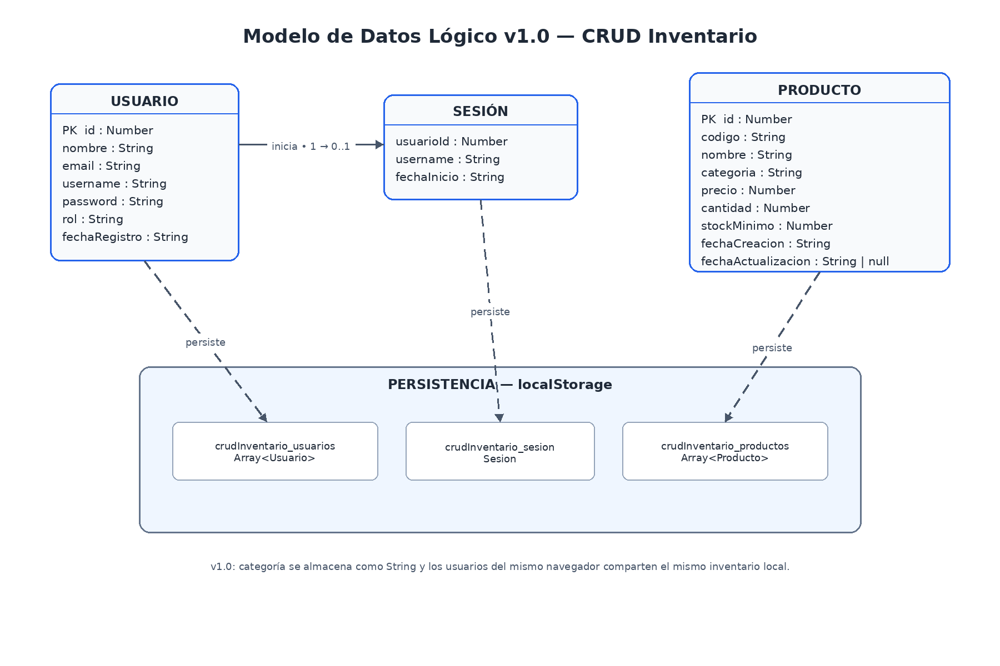

# Modelo de Datos — CRUD Inventario

## 1. Introducción

El modelo de datos define la información que necesita almacenar y utilizar el sistema CRUD Inventario durante su funcionamiento.

Para la versión 1.0 no se utilizará todavía una base de datos mediante servidor. La información será representada mediante objetos y arrays de JavaScript y persistida en el navegador utilizando `localStorage`.

El modelo inicial estará compuesto principalmente por:

* Usuario.
* Producto.
* Sesión.

Las categorías formarán inicialmente parte de la información de cada producto y no serán tratadas como una entidad independiente.

---

## 2. Objetivo del modelo de datos

Definir de manera clara:

* Qué información necesita el sistema.
* Qué datos pertenecen a un usuario.
* Qué datos pertenecen a un producto.
* Qué tipo de dato utilizará cada propiedad.
* Qué datos son obligatorios.
* Qué reglas deberán cumplirse.
* Cómo será almacenada la información en `localStorage`.
* Cómo se relacionarán estos datos con la lógica JavaScript.

---

# 3. Entidad Usuario

La entidad **Usuario** representa una persona que puede registrarse e iniciar sesión en la aplicación.

## 3.1 Estructura del usuario

| Campo           | Tipo          | Obligatorio | Descripción                              |
| --------------- | ------------- | ----------: | ---------------------------------------- |
| `id`            | Number/String |          Sí | Identificador único del usuario          |
| `nombre`        | String        |          Sí | Nombre del usuario                       |
| `email`         | String        |          Sí | Correo electrónico                       |
| `username`      | String        |          Sí | Nombre utilizado para iniciar sesión     |
| `password`      | String        |          Sí | Contraseña utilizada en la versión local |
| `rol`           | String        |          Sí | Rol asignado al usuario                  |
| `fechaRegistro` | String        |          Sí | Fecha de creación de la cuenta           |

---

## 3.2 Ejemplo conceptual

```js
const usuario = {
  id: 1,
  nombre: "Carlos Saenz",
  email: "usuario@correo.com",
  username: "carlos",
  password: "********",
  rol: "administrador",
  fechaRegistro: "2026-08-24"
};
```

Este ejemplo representa la forma que tendrá un usuario dentro de JavaScript.

> La contraseña mostrada es únicamente ilustrativa. No deberán utilizarse contraseñas reales durante las pruebas del proyecto.

---

## 3.3 Reglas del usuario

* Cada usuario deberá tener un identificador único.
* El nombre será obligatorio.
* El correo será obligatorio.
* El correo deberá tener un formato válido.
* El nombre de usuario será obligatorio.
* No deberán existir dos usuarios con el mismo `username`.
* La contraseña será obligatoria.
* La fecha de registro se generará cuando se cree la cuenta.

Inicialmente las cuentas creadas para utilizar el sistema tendrán el rol:

`administrador`

La gestión completa de roles será considerada para futuras versiones.

---

## 3.4 Consideración de seguridad

En la versión 1.0 los usuarios serán almacenados localmente con fines exclusivamente educativos.

El almacenamiento de credenciales mediante JavaScript y `localStorage` **no representa un sistema seguro de autenticación para producción**.

Una versión futura deberá utilizar:

* Backend.
* Base de datos.
* Contraseñas protegidas adecuadamente.
* Gestión segura de sesiones.
* Autorización por roles.

---

# 4. Entidad Producto

La entidad **Producto** representa cada elemento almacenado dentro del inventario.

Es la entidad principal del sistema.

## 4.1 Estructura del producto

| Campo                | Tipo          | Obligatorio | Descripción                             |
| -------------------- | ------------- | ----------: | --------------------------------------- |
| `id`                 | Number/String |          Sí | Identificador interno único             |
| `codigo`             | String        |          Sí | Código comercial o interno del producto |
| `nombre`             | String        |          Sí | Nombre del producto                     |
| `categoria`          | String        |          Sí | Categoría a la que pertenece            |
| `precio`             | Number        |          Sí | Precio del producto                     |
| `cantidad`           | Number        |          Sí | Existencias disponibles                 |
| `stockMinimo`        | Number        |          Sí | Cantidad mínima recomendada             |
| `fechaCreacion`      | String        |          Sí | Fecha de registro                       |
| `fechaActualizacion` | String        |          No | Fecha de última modificación            |

---

## 4.2 Ejemplo conceptual

```js
const producto = {
  id: 1,
  codigo: "P001",
  nombre: "Arroz 1 kg",
  categoria: "Alimentos",
  precio: 4500,
  cantidad: 20,
  stockMinimo: 5,
  fechaCreacion: "2026-08-24",
  fechaActualizacion: null
};
```

---

# 5. Diferencia entre `id` y `codigo`

Aunque ambos permiten identificar productos, cumplen funciones diferentes.

### `id`

Será un identificador interno utilizado por la aplicación.

Ejemplo:

```text
1
2
3
4
```

El usuario normalmente no tendrá que modificarlo.

### `codigo`

Será un identificador relacionado con el producto y visible para el usuario.

Ejemplo:

```text
P001
P002
P003
```

Por esta razón un producto podrá tener:

```js
{
  id: 15,
  codigo: "P001"
}
```

El `id` identifica internamente el registro y el `codigo` identifica el producto desde la perspectiva del inventario.

---

# 6. Reglas de los productos

## Identificador

Cada producto deberá tener un `id` único.

## Código

El código:

* será obligatorio;
* deberá ser único;
* no deberá repetirse en otro producto.

## Nombre

El nombre:

* será obligatorio;
* deberá contener información válida.

## Categoría

Cada producto deberá pertenecer a una categoría.

Ejemplos:

* Alimentos.
* Bebidas.
* Aseo.
* Tecnología.
* Papelería.

Inicialmente la categoría será almacenada directamente como un texto dentro del producto.

## Precio

El precio:

* deberá ser numérico;
* no podrá ser negativo.

## Cantidad

La cantidad:

* deberá ser numérica;
* deberá ser un número entero;
* no podrá ser negativa.

## Stock mínimo

El stock mínimo:

* deberá ser numérico;
* no podrá ser negativo;
* será utilizado para determinar cuándo existe bajo stock.

---

# 7. Estado del stock

El estado del stock **no necesita almacenarse como otro dato**, porque puede calcularse utilizando:

```text
cantidad
```

y:

```text
stockMinimo
```

La regla será:

```js
cantidad <= stockMinimo
```

Si esta condición se cumple:

```text
Stock bajo
```

Si no se cumple:

```text
Stock disponible
```

Ejemplo:

```js
const producto = {
  cantidad: 3,
  stockMinimo: 5
};
```

Como:

```text
3 <= 5
```

el producto tendrá:

```text
Stock bajo
```

Este valor será **calculado**, no almacenado.

---

# 8. Datos almacenados y datos calculados

Es importante distinguir ambos conceptos.

## Datos almacenados

Son valores que necesitamos guardar:

```text
codigo
nombre
categoria
precio
cantidad
stockMinimo
```

## Datos calculados

Son valores que podemos obtener a partir de otros datos:

```text
estadoStock
totalProductos
productosStockBajo
numeroCategorias
```

Por ejemplo:

```text
cantidad = 3
stockMinimo = 5

        ↓

estadoStock = "Stock bajo"
```

No necesitamos guardar `estadoStock` porque podemos volver a calcularlo cuando sea necesario.

---

# 9. Colección de productos

Un inventario no tendrá solamente un producto.

Por esta razón los productos serán almacenados dentro de un **array**.

Ejemplo conceptual:

```js
const productos = [
  {
    id: 1,
    codigo: "P001",
    nombre: "Arroz 1 kg",
    categoria: "Alimentos",
    precio: 4500,
    cantidad: 20,
    stockMinimo: 5
  },

  {
    id: 2,
    codigo: "P002",
    nombre: "Leche 1 L",
    categoria: "Bebidas",
    precio: 3800,
    cantidad: 3,
    stockMinimo: 5
  }
];
```

Conceptualmente:

```text
Inventario
│
├── Producto 1
├── Producto 2
├── Producto 3
├── Producto 4
└── ...
```

---

# 10. Colección de usuarios

Los usuarios también podrán representarse mediante un array:

```js
const usuarios = [
  {
    id: 1,
    nombre: "Usuario Uno",
    email: "usuario1@correo.com",
    username: "usuario1",
    password: "********",
    rol: "administrador"
  },

  {
    id: 2,
    nombre: "Usuario Dos",
    email: "usuario2@correo.com",
    username: "usuario2",
    password: "********",
    rol: "administrador"
  }
];
```

---

# 11. Modelo de sesión

La sesión permitirá identificar que un usuario ya inició sesión.

No será necesario guardar nuevamente todos los datos del usuario.

Puede representarse conceptualmente mediante:

```js
const sesion = {
  usuarioId: 1,
  username: "carlos",
  fechaInicio: "2026-08-24"
};
```

La existencia de esta información permitirá determinar si existe una sesión activa.

---

# 12. Relación conceptual entre los datos

El modelo inicial puede representarse de la siguiente manera:

```text
USUARIO
   │
   │ se registra
   │ inicia sesión
   ▼
SESIÓN
   │
   │ permite acceder
   ▼
SISTEMA DE INVENTARIO
   │
   │ gestiona
   ▼
PRODUCTOS
```

En la versión 1.0 todos los usuarios autorizados del mismo navegador trabajarán sobre el mismo inventario local.

Todavía no existirá:

* Separación de inventarios por usuario.
* Separación por empresa.
* Sistema multiempresa.
* Base de datos centralizada.

---

# 13. Categorías

Para mantener sencilla la versión 1.0, **Categoría no será todavía una entidad independiente**.

Se almacenará directamente dentro de cada producto:

```js
{
  nombre: "Arroz",
  categoria: "Alimentos"
}
```

En futuras versiones podrá evolucionar hacia una estructura independiente:

```text
Categoria
├── id
├── nombre
└── descripcion
```

Esto permitiría administrar categorías mediante su propio CRUD.

---

# 14. Persistencia mediante localStorage

`localStorage` permite guardar información en el navegador.

Sin embargo, `localStorage` almacena principalmente valores en formato texto.

Por esta razón los arrays y objetos JavaScript deberán convertirse antes de almacenarse.

Conceptualmente:

```text
Array de productos
        ↓
JSON.stringify()
        ↓
Texto
        ↓
localStorage
```

Para recuperar los datos:

```text
localStorage
        ↓
Texto
        ↓
JSON.parse()
        ↓
Array de productos
```

Este proceso será implementado posteriormente dentro de:

`js/storage.js`

---

# 15. Claves de almacenamiento

Para evitar confusión entre diferentes tipos de información se utilizarán claves diferentes.

Inicialmente:

| Clave                      | Contenido                 |
| -------------------------- | ------------------------- |
| `crudInventario_productos` | Lista de productos        |
| `crudInventario_usuarios`  | Lista de usuarios         |
| `crudInventario_sesion`    | Sesión actualmente activa |

Ejemplo conceptual:

```text
localStorage
│
├── crudInventario_productos
├── crudInventario_usuarios
└── crudInventario_sesion
```

---

# 16. Correspondencia con los archivos JavaScript

La estructura actual del proyecto permitirá separar responsabilidades.

```text
js/
├── login.js
├── productos.js
└── storage.js
```

## `login.js`

Se encargará principalmente de:

* Registro.
* Inicio de sesión.
* Validación de credenciales.
* Control de sesión.
* Cierre de sesión.

## `productos.js`

Se encargará principalmente de:

* Crear productos.
* Mostrar productos.
* Buscar productos.
* Actualizar productos.
* Eliminar productos.
* Identificar stock bajo.

## `storage.js`

Se encargará principalmente de:

* Leer datos de `localStorage`.
* Guardar datos.
* Convertir objetos a JSON.
* Convertir JSON nuevamente a objetos JavaScript.

---

# 17. Modelo conceptual general

```text
┌─────────────────┐
│     Usuario     │
├─────────────────┤
│ id              │
│ nombre          │
│ email           │
│ username        │
│ password        │
│ rol             │
│ fechaRegistro   │
└────────┬────────┘
         │
         │ inicia
         ▼
┌─────────────────┐
│      Sesión     │
├─────────────────┤
│ usuarioId       │
│ username        │
│ fechaInicio     │
└────────┬────────┘
         │
         │ permite gestionar
         ▼
┌─────────────────────┐
│      Producto       │
├─────────────────────┤
│ id                  │
│ codigo              │
│ nombre              │
│ categoria           │
│ precio              │
│ cantidad            │
│ stockMinimo         │
│ fechaCreacion       │
│ fechaActualizacion  │
└─────────────────────┘
```

---

# 18. Evolución futura del modelo

En futuras versiones podrán incorporarse nuevas entidades como:

```text
Empresa
Categoria
Proveedor
MovimientoInventario
UsuarioRol
Venta
Compra
```

Por ejemplo, cuando se implemente control real de entradas y salidas podrá añadirse:

```text
MovimientoInventario
│
├── id
├── productoId
├── tipo
├── cantidad
├── fecha
└── usuarioId
```

Esta ampliación no forma parte del alcance actual de la versión 1.0.

---

# 19. Estado actual

**Estado:** Modelo lógico inicial definido.

Para la versión 1.0 se trabajará principalmente con tres estructuras:

1. Usuario.
2. Producto.
3. Sesión.

Los datos serán representados mediante objetos y arrays de JavaScript y almacenados mediante `localStorage`.

El modelo podrá evolucionar cuando el proyecto incorpore backend y una base de datos real.

## Diagrama del modelo de datos

El siguiente diagrama representa el modelo conceptual utilizado por la versión 1.0 del sistema, compuesto por Usuario, Sesión y Producto, junto con su persistencia mediante localStorage.

